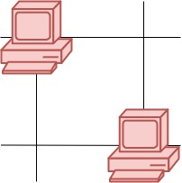
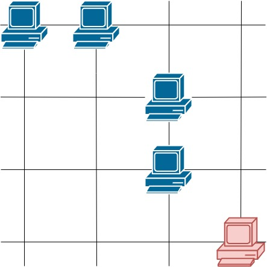

# 1267. Count Servers that Communicate
https://leetcode.com/problems/count-servers-that-communicate/description/

## Problem Description

You are given a map of a server center, represented as a `m * n` integer matrix `grid`, where 1 means that on that cell there is a server and 0 means that it is no server. Two servers are said to communicate if they are on the same row or on the same column.

Return the number of servers that communicate with any other server.

## Example 1:



```
Input: grid = [[1,0],[0,1]]
Output: 0
Explanation: No servers can communicate with others.
```

## Example 2:


```
Input: grid = [[1,0],[1,1]]
Output: 3
Explanation: All three servers can communicate with at least one other server.
```

## Example 3:


```
Input: grid = [[1,1,0,0],[0,0,1,0],[0,0,1,0],[0,0,0,1]]
Output: 4
Explanation: The two servers in the first row can communicate with each other. The two servers in the third column can communicate with each other. The server at right bottom corner can't communicate with any other server.
```

## Constraints:

- `m == grid.length`
- `n == grid[i].length`
- `1 <= m <= 250`
- `1 <= n <= 250`
- `grid[i][j] == 0 or 1`

---

## 解法
根據題目所說只要同一行或列上有其他的 server 就可以將當前的 Server 加到 `ret` 中，所以我們只需要透過2個 hash map 去紀錄行或列上的主機數量，接著遍歷所有主機看行或列上是否有其他的主機`row[i] > 1 || col[j] > 1` 就知道這台是否可連接的主機。
