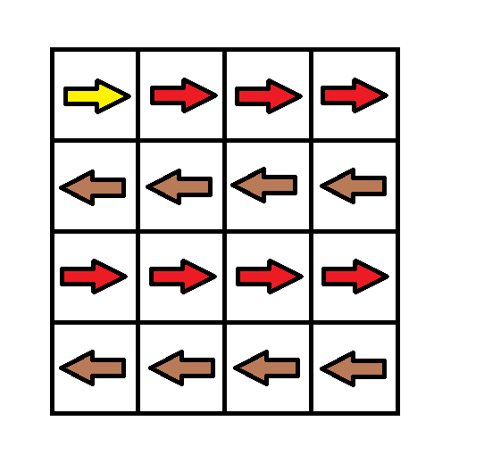
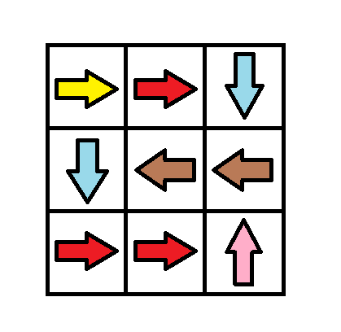
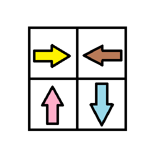

# 1368. Minimum Cost to Make at Least One Valid Path in a Grid
https://leetcode.com/problems/minimum-cost-to-make-at-least-one-valid-path-in-a-grid/description/
## Problem Description

You are given an `m*n` grid where each cell contains a directional sign, represented as follows:
- \( 1 \): Go to the right (from \( grid[i][j] \) to \( grid[i][j+1] \)).
- \( 2 \): Go to the left (from \( grid[i][j] \) to \( grid[i][j-1] \)).
- \( 3 \): Go down (from \( grid[i][j] \) to \( grid[i+1][j] \)).
- \( 4 \): Go up (from \( grid[i][j] \) to \( grid[i-1][j] \)).

You start at the top-left corner \((0, 0)\) and want to reach the bottom-right corner \((m - 1, n - 1)\). If the grid does not contain a valid path, you can modify the directional sign of any cell at a cost of 1 per modification.

Your goal is to find the minimum cost required to ensure that there exists at least one valid path from \((0, 0)\) to \((m - 1, n - 1)\).

---

## Examples

### Example 1:

**Input:**  
`grid = [[1,1,1,1],[2,2,2,2],[1,1,1,1],[2,2,2,2]]`  
**Output:**  
`3`  
**Explanation:**  
You can modify the grid to create a valid path with a total cost of 3.  

---

### Example 2:
**Input:**  
`grid = [[1,1,3],[3,2,2],[1,1,4]]`  
**Output:**  
`0`  
**Explanation:**  
No modifications are required as a valid path already exists.

---

### Example 3:
**Input:**  
`grid = [[1,2],[4,3]]`  
**Output:**  
`1`  
**Explanation:**  
One modification is required to create a valid path.

---

## Constraints

- `m == grid.length`
- `n == grid[i].length`
- `1 <= m, n <= 100`
- `1 <= grid[i][j] <= 4`

---

## 解法

可以看出有 BFS 的需求，並且路徑會有權重，且權重不為負，可以想到 Dijkstra 算法。

我們利用 BFS 去對4個方向搜索，當指定搜索方向與 grid[i][j] 一致時不需要增加 cost 反之 cost + 1。每次搜索都會用 min heap 找出最小的 cost 先進行搜索。