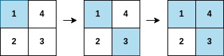

# 2661. First Completely Painted Row or Column
https://leetcode.com/problems/first-completely-painted-row-or-column/

## Problem Description

You are given a 0-indexed integer array `arr` and an `m x n` integer matrix `mat`. Both `arr` and `mat` contain all the integers in the range `[1, m * n]`.

You process each index `i` in `arr` starting from index `0` and paint the cell in `mat` that contains the integer `arr[i]`.

Return the smallest index `i` at which either a row or a column in `mat` will be completely painted.

## Example 1:


**Input:** 
```
arr = [1,3,4,2]
mat = [[1,4],[2,3]]
```

**Output:**
```
2
```

**Explanation:**
- At `arr[0] = 1`, the cell containing `1` is painted.
- At `arr[1] = 3`, the cell containing `3` is painted.
- At `arr[2] = 4`, the cell containing `4` is painted.

Both the first row and the second column are fully painted at this step.

## Example 2:


**Input:**
```
arr = [2,8,7,4,1,3,5,6,9]
mat = [[3,2,5],[1,4,6],[8,7,9]]
```

**Output:**
```
3
```

**Explanation:**
- At `arr[0] = 2`, the cell containing `2` is painted.
- At `arr[1] = 8`, the cell containing `8` is painted.
- At `arr[2] = 7`, the cell containing `7` is painted.
- At `arr[3] = 4`, the cell containing `4` is painted.

At this point, the second column is fully painted.

## Constraints:

- `m == mat.length`
- `n == mat[i].length`
- `arr.length == m * n`
- `1 <= m, n <= 10⁵`
- `1 <= m * n <= 10⁵`
- `1 <= arr[i], mat[r][c] <= m * n`
- All the integers of `arr` are unique.
- All the integers of `mat` are unique.

---

## 解法
根據題目所說就是在玩賓果，只要任意一個列或是行連線，就把當前遍歷的 `i` 回傳。

我們需要做的事就是建立 `hash`，去紀錄數字對應的座標，這樣在遍歷 `arr` 才知道座標。

接著遍歷 `arr`，透過另外建立的兩個 vector，分別去紀錄列上或行上目前累積的數量，當數量滿足整條列或行的數量則返回`i`。

