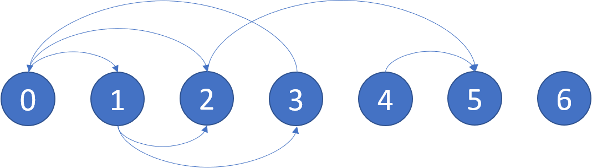

# 802. Find Eventual Safe States
https://leetcode.com/problems/find-eventual-safe-states/

## Problem Description

There is a directed graph of `n` nodes with each node labeled from `0` to `n - 1`. The graph is represented by a 0-indexed 2D integer array `graph` where `graph[i]` is an integer array of nodes adjacent to node `i`, meaning there is an edge from node `i` to each node in `graph[i]`.

A node is a terminal node if there are no outgoing edges. A node is a safe node if every possible path starting from that node leads to a terminal node (or another safe node).

Return an array containing all the safe nodes of the graph. The answer should be sorted in ascending order.

## Example 1:


```
Input: graph = [[1,2],[2,3],[5],[0],[5],[],[]]
Output: [2,4,5,6]
Explanation: The given graph is shown above.
Nodes 5 and 6 are terminal nodes as there are no outgoing edges from either of them.
Every path starting at nodes 2, 4, 5, and 6 all lead to either node 5 or 6.
```

## Example 2:

```
Input: graph = [[1,2,3,4],[1,2],[3,4],[0,4],[]]
Output: [4]
Explanation:
Only node 4 is a terminal node, and every path starting at node 4 leads to node 4.
```

## Constraints:

- `n == graph.length`
- `1 <= n <= 104`
- `0 <= graph[i].length <= n`
- `0 <= graph[i][j] <= n - 1`
- `graph[i]` is sorted in a strictly increasing order.
- The graph may contain self-loops.
- The number of edges in the graph will be in the range `[1, 4 * 104]`.

---

## 解法
本題可以看出只要有環，就是不安全的節點。
直接使用 dfs 中的顏色標記法，此方法適用於有向圖。

顏色標記法的三種狀態：
白色 (0): 節點尚未訪問。
灰色 (1): 節點正在訪問中（即在遞歸堆疊中）。
黑色 (2): 節點已完成訪問，確認安全，並且不會導致環。

演算法的邏輯：
遍歷圖中的每個節點，若該節點是白色（未訪問），則以該節點作為起點進行 DFS。
在 DFS 過程中，當發現某個節點是灰色時，意味著出現了一條回邊（cycle），圖中有環。
若成功完成某個節點的遍歷且未發現環，則將該節點標記為黑色。
所有黑色節點最終被確定為「安全節點」。
